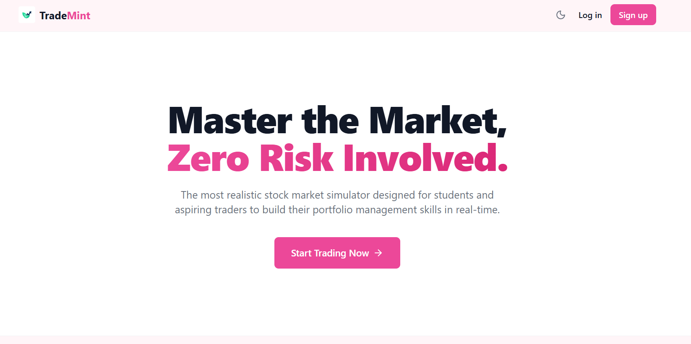
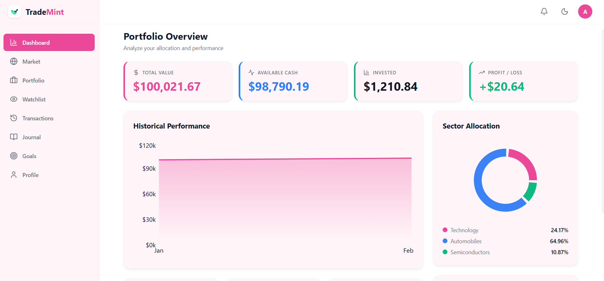

<div align="center">
  
  
  
  
  
</div>

<h1 align="center">TradeMint</h1>

<p align="center">
  <strong>Master the Market. Zero Risk Involved.</strong><br>
  A high-performance, full-stack stock market simulation platform designed for portfolio management practice and real-time market simulation.
</p>

## 🚀 Live Demo
🌐 **TradeMint:** https://trade-mint-git-main-arjunvashishtha13-7704s-projects.vercel.app/
---

## 📸 Platform Previews

<div align="center">
  
  <br/>
  <i>Clean, modern landing page with a strong call-to-action.</i>
  <br/><br/>
  
  <br/>
  <i>Comprehensive portfolio dashboard with real-time sector allocation and historical performance.</i>
</div>

---

## 💡 Why TradeMint?

TradeMint is a virtual stock trading platform built to simulate real-world investing and portfolio management. The project allows users to trade stocks using virtual capital, track portfolio performance, manage watchlists, and analyze investment decisions through an intuitive dashboard.

### Key Highlights

* Developed a full-stack trading platform with secure user authentication, portfolio management, and transaction tracking.
* Built real-time portfolio analytics including profit/loss calculations, asset allocation insights, and performance visualization.
* Integrated live market data to provide dynamic stock prices and realistic trading simulations.
* Designed scalable REST APIs using Node.js, Express.js, and MongoDB following MVC architecture principles.
* Implemented interactive dashboards, charts, and watchlist management features to enhance user experience.
* Engineered role-based authentication using JWT and bcrypt to ensure secure access and data protection.


## 🛠️ Technical Stack

### Frontend (Client)
- **Framework:** React.js (via Vite for optimized build times and HMR)
- **Styling:** TailwindCSS v4 for utility-first, responsive, and highly customizable UI components.
- **Animations:** Framer Motion for fluid micro-interactions and page transitions.
- **Routing:** React Router v6 for seamless Single Page Application (SPA) navigation.
- **HTTP Client:** Axios with request interceptors for automated JWT injection.

### Backend (Server)
- **Runtime:** Node.js
- **Framework:** Express.js
- **Database:** MongoDB (Atlas) with Mongoose ODM
- **Security:** JSON Web Tokens (JWT) for stateless auth, bcryptjs for hashing.
- **Market Data:** Finnhub API integration for fetching real-time market quotes and company profiles.

---

## ⚙️ Architecture & Data Flow

The application follows a strictly decoupled client-server architecture:
1. **Frontend Layer:** Acts solely as the presentation and state management layer. It requests data via Axios and handles UI rendering based on server responses.
2. **Controller Layer (Express):** Contains all business logic. When a user executes a trade (`POST /api/v1/transactions/trade`), the controller:
   - Validates the current market price via the Finnhub API.
   - Computes portfolio balances and ensures sufficient funds.
   - Atomically updates the `Portfolio`, creates a `Transaction` ledger, and updates the specific `Holding`.
3. **Database Layer (MongoDB):** Relational-like schemas linked via ObjectIds to precisely tie Users to their unique Portfolios, Holdings, and Watchlists.

---

## 💻 Running Locally

### Prerequisites
- Node.js (v18+ recommended)
- MongoDB (Local instance or MongoDB Atlas URI)
- Finnhub API Key (Free tier)

### 1. Clone the repository
```bash
git clone https://github.com/yourusername/TradeMint.git
cd TradeMint
```

### 2. Setup the Backend
```bash
cd backend
npm install
```
Create a `.env` file in the `backend` directory:
```env
PORT=3002
MONGO_URL=your_mongodb_connection_string
JWT_SECRET=your_super_secret_jwt_key
JWT_EXPIRE=7d
NODE_ENV=development
FINNHUB_API_KEY=your_finnhub_key
```
Run the backend server:
```bash
npm run dev
```

### 3. Setup the Frontend
```bash
cd ../client
npm install
```
Create a `.env` file in the `client` directory:
```env
VITE_API_URL=http://localhost:3002/api/v1
```
Run the frontend server:
```bash
npm run dev
```

---


---
Author- ARJUN VASHISHTHA
